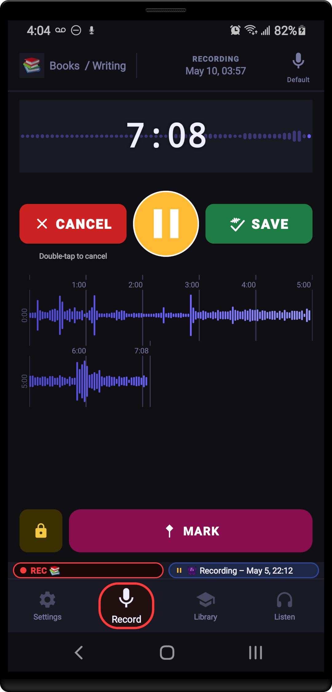
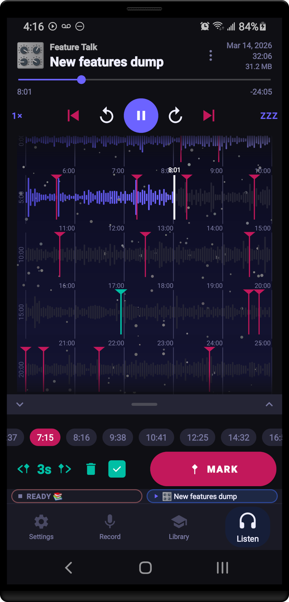
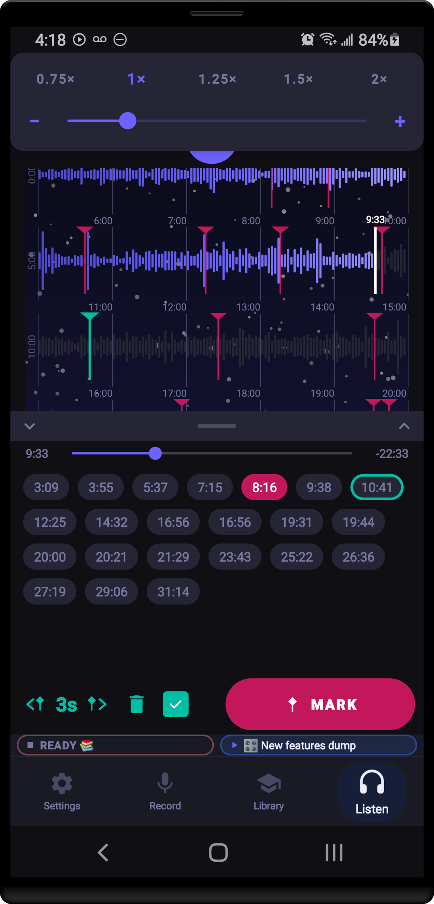
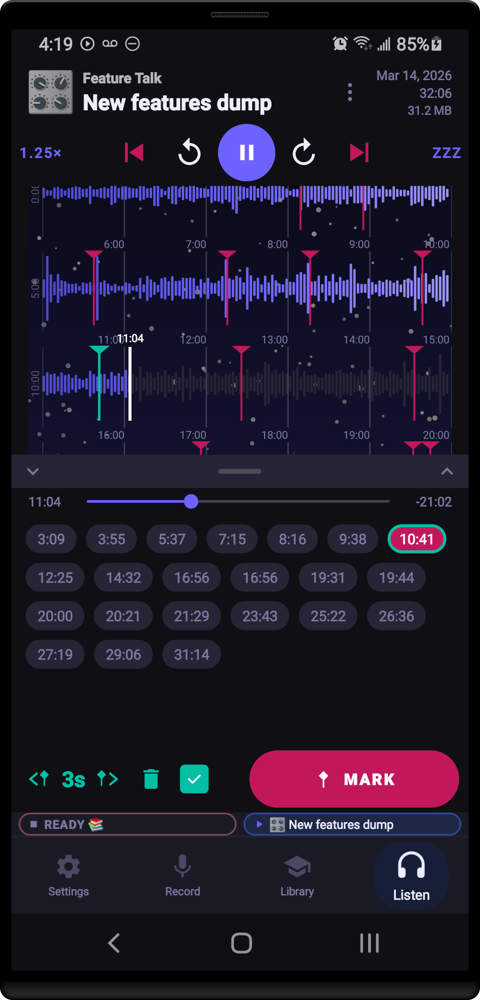
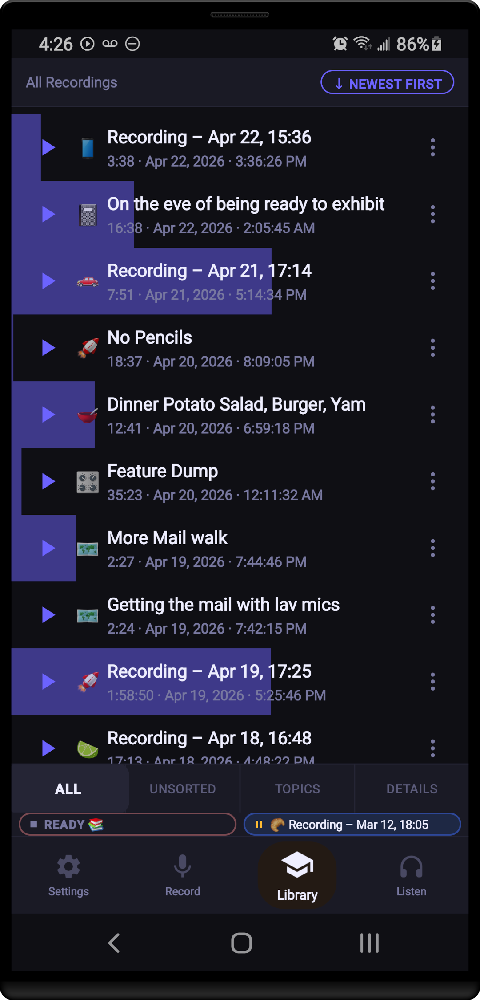
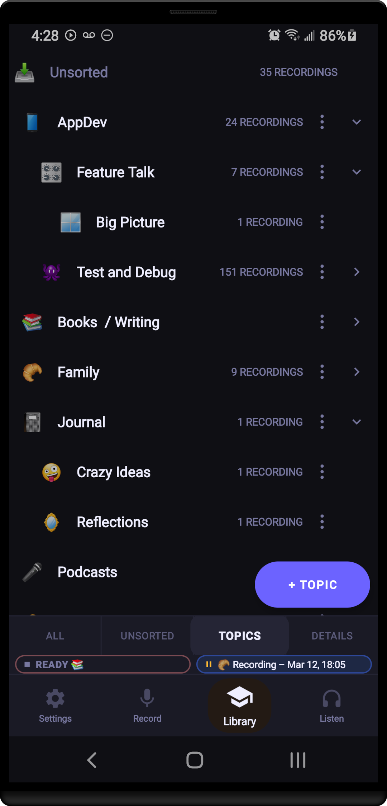
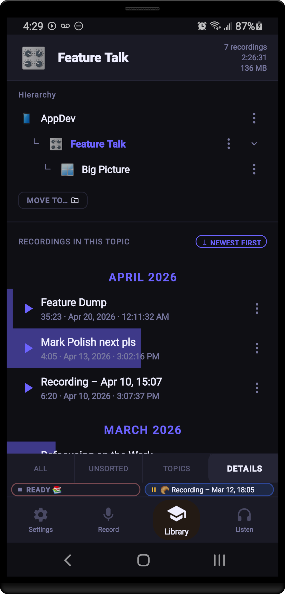
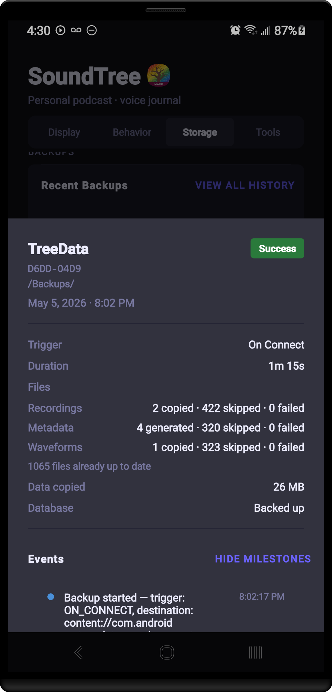

# SoundTree

**A personal audio recorder and organiser for Android.**

Record audio, sort it into a hierarchical topic tree, mark moments, and play it back — entirely on-device, with no accounts, no cloud, and no tracking.

> Licensed under [GPL-3.0](LICENSE)

---

## Screenshots

| Record | Waveform | Listen | Marks |
|:------:|:--------:|:------:|:-----:|
|  |  |  |  |

| Library | Topics | Details | Backup |
|:-------:|:------:|:-------:|:------:|
|  |  |  |  |

---

## Features

### 🎙️ Recording

SoundTree records with a live scrolling waveform so you always know the microphone is active. You can:

- **Pause and resume** without starting a new file
- **Save from the notification** — lock your screen and walk away; tap *Save* in the status bar when you're done, with no need to unlock
- **Name recordings** on the fly, or rename them later from the library
- **Choose your input source** (built-in mic, wired headset, Bluetooth, etc)
- **Assign a topic** before you hit record so the file lands exactly where you want it
- **Cancel safely** with a double-tap confirmation, so accidental taps don't throw away a recording

---

### 📈 Live Waveform

Every recording gets a multi-line waveform that shows the shape of the whole audio at a glance — not just a thin progress bar. Waveform data is analysed in the background after saving and cached on disk, so it loads instantly on every subsequent open.

Three built-in visual styles, plus the option to turn them off entirely:

| Style | Description |
|-------|-------------|
| **Standard** | Clean, minimal amplitude bars |
| **Sky** | Gradient colour wash, adapts to light and dark themes |
| **SkyLights** | Sky palette with an extra luminance layer |
| **Off** | Plain bars, no background scene |

Background opacity, ruler coverage, and the "unplayed region only" clip mode are all tunable in Settings.

---

### 🎧 Playback

The Listen tab gives you a full-featured playback experience:

- **Variable speed** from 0.25× to 4.0× with one-tap presets and a fine-tune slider
- **Configurable skip buttons** — set your preferred scrub-back and scrub-forward durations independently (e.g. 10 s back, 30 s forward)
- **Seek bar and time labels** — elapsed and remaining time always visible
- **Full waveform** — tap anywhere to seek, watch the played/unplayed split move in real time

#### Playback Memory

SoundTree remembers where you stopped — but it's configurable:

- **Always** — resume position saved for every recording
- **Long recordings only** — only remember position for recordings above a configurable duration threshold
- **Never** — always start from the beginning

A smart **near-end reset** rule automatically restarts from the beginning if you stopped very close to the end of a recording, so you never tap play and hear two seconds of audio before it stops. The threshold is separately tunable for short recordings (seconds from end) and long ones (percentage of duration).

---

### 🔖 Marks

Marks are lightweight timestamps you drop into a recording to flag moments worth revisiting — a key decision in a meeting, a quote to come back to, a cue point.

- **Add a mark** with one tap during recording *or* during playback
- **Nudge** a selected mark backward or forward by a configurable amount to fine-tune its position without re-listening
- **Jump between marks** with previous/next buttons — the previous button rewinds to the current mark if you're within a configurable threshold, rather than skipping all the way back
- **Mark count in the notification** so you can keep track while your screen is off
- Marks are saved with the recording and shown as tick lines on the waveform

---

### 📚 Library

The Library is the hub for browsing and managing everything you've recorded. It's divided into sub-pages accessible from the tab strip:

- **All** — a flat, sortable list of every recording across all topics, with newest/oldest toggle
- **Unsorted** — recordings that haven't been assigned a topic yet (the inbox)
- **Topics** — the full hierarchical topic tree for navigation and management
- **Details** — a focused view for a selected topic (see below)

Each recording row shows its topic icon, title, and duration. Rows for the currently-playing recording animate a **playhead tint** — the played portion of the row is visually distinct from the unplayed portion, so you can see your progress in the list without opening the recording. The tint intensity is adjustable in Settings.

Tap a row to start playback, long-press or tap ⋮ to rename, move, or delete.

---

### 🌳 Topics & Organisation

Recordings live in a **hierarchical topic tree** — nested as deeply as you like, with no arbitrary folder-depth limit.

- **Inbox** catches every unsorted recording so nothing gets lost
- **Emoji icons** per topic for quick visual scanning
- **Collapse / expand** any branch to keep the view tidy, state preserved across sessions
- **Move recordings** between topics at any time via a bottom-sheet topic picker
- **Move topics** — reparent an entire branch of the tree in one action

#### Topic Details

Tap any topic in the tree to open its **Details** page:

- **Header** — topic icon (tap to change), name (tap to rename), and at-a-glance stats: recording count, total duration, total storage used
- **Hierarchy strip** — the full ancestor chain from root to this topic, each node tappable to navigate up
- **Recording list** — all recordings in this topic, sortable by newest or oldest, with the same playhead tint and overflow actions as the main library

---

### 💾 Automatic Backups

SoundTree can automatically back up your recordings to an external drive or USB OTG device — no cloud required, no subscription.

- **Trigger on connect** — the moment you plug in a designated drive, a backup starts automatically
- **Periodic backup** — a configurable interval (default 24 h) for drives left plugged in
- **Backs up everything** — audio files, metadata sidecar JSON files, and waveform cache files, each tracked separately in the log
- **Progress strip** in the title bar shows the active backup target and file count; tapping it jumps straight to the Storage settings
- **Detailed backup log** — every job records how many recordings, metadata files, and waveforms were copied, skipped, or failed, so you always know exactly what happened
- Restore support is **coming soon** — backups made today will be fully restorable in a future release

---

### 🎛️ Mini Widgets

SoundTree keeps the recorder and player accessible from any screen via compact mini widgets that sit alongside the navigation bar. Both widgets can be **minimized to a pill** in the title bar to reclaim screen space, then tapped to restore.

- **Mini Recorder** — shows recording state, elapsed time, a timeline, and mark controls; tap it to jump to the full Record tab
- **Mini Player** — shows the now-playing title, play/pause, and skip controls with a live progress timeline
- **Customisable layout order** — drag the title bar, mini player, mini recorder, and nav bar into whatever vertical order suits your workflow from Settings > Display

---

### ⚙️ Settings

Settings are split across four tabs:

**Display**
- Theme (Light / Dark / System)
- Waveform style (Standard / Sky / SkyLights / Off), background opacity, ruler coverage, unplayed-only clip
- Playhead visualisation toggle and tint intensity
- Layout order editor (drag-to-reorder the title bar, mini widgets, content, and nav)
- Widget visibility (Always / While recording or playing / Never) and always-show-pill option
- Stats dashboard: recording count, total recorded time, topic count, storage used per volume, last session

**Behavior**
- Navigation shortcuts (auto-switch to Listen on play, auto-jump to Library after saving)
- Skip-back and skip-forward durations
- Mark nudge amount and mark rewind threshold
- Playback memory mode (Always / Long-only / Never) and near-end reset rules

**Storage**
- Default recording volume
- Per-volume storage usage with online/offline status
- Backup target management (add, configure, remove) and backup logs

**Tools**
- Waveform processing queue (view active, pending, and recent jobs)
- Regenerate all waveforms
- Orphaned recording recovery

---

### 🔒 Privacy

SoundTree has **no network permission**. There is no analytics, no crash reporter, no ad SDK, and no account system. Your recordings never leave your device unless you explicitly copy them somewhere.

---

## Building from Source

**Requirements:** Android Studio Hedgehog or newer · Android SDK 34 · JDK 11+

```bash
git clone https://github.com/CodeMarbles/SoundTree
cd SoundTree
./gradlew assembleDebug
adb install app/build/outputs/apk/debug/app-debug.apk
```

---

## Key Dependencies

| Library                  | Purpose                                    |
|--------------------------|--------------------------------------------|
| Room 2.6                 | Local SQLite database with KSP codegen     |
| ViewPager2               | Tab and sub-page navigation                |
| MediaRecorder            | Audio capture (M4A/AAC)                    |
| MediaPlayer              | Playback with resume position              |
| WorkManager              | Background waveform analysis and scheduled backups |
| Material Components      | Buttons, BottomSheets, dialogs             |
| Kotlin Coroutines + Flow | Reactive data pipeline from DB to UI       |

---

## License

SoundTree is free software, licensed under the [GNU General Public License v3.0](LICENSE).  
You are free to use, study, modify, and redistribute it under the same terms.